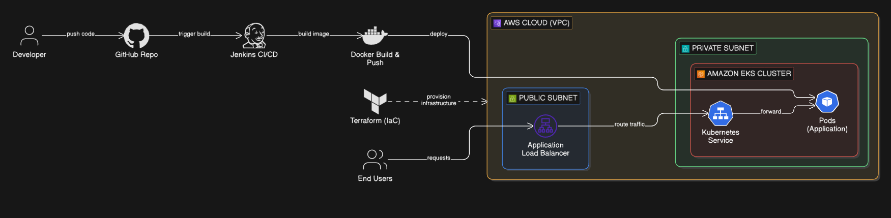

# 🚀 Automated CI/CD Pipeline on AWS EKS using Terraform & Jenkins

## 📌 Overview
This project demonstrates a production-ready DevOps pipeline that automates infrastructure provisioning and application deployment on AWS.

It uses:
- Terraform for Infrastructure as Code (IaC)
- Jenkins for CI/CD automation
- Docker for containerization
- Amazon EKS for Kubernetes orchestration

---

## 🏗️ Architecture

### CI/CD Flow
1. Developer pushes code to GitHub  
2. Jenkins pipeline is triggered  
3. Docker image is built and pushed  
4. Jenkins deploys application to EKS using kubectl  
5. Application is exposed via AWS Load Balancer  

---

### AWS Infrastructure
- VPC
  - Public Subnet → Application Load Balancer (ALB)
  - Private Subnet → EKS Cluster

- EKS Cluster
  - Kubernetes Services
  - Application Pods

---

### Terraform (IaC)
Terraform provisions:
- VPC
- Public & Private Subnets
- IAM Roles & Security Groups
- Amazon EKS Cluster
- Load Balancer

---

## 🧩 Tech Stack

- AWS (EKS, VPC, IAM, EC2)
- Terraform
- Jenkins
- Docker
- Kubernetes
- GitHub

---
